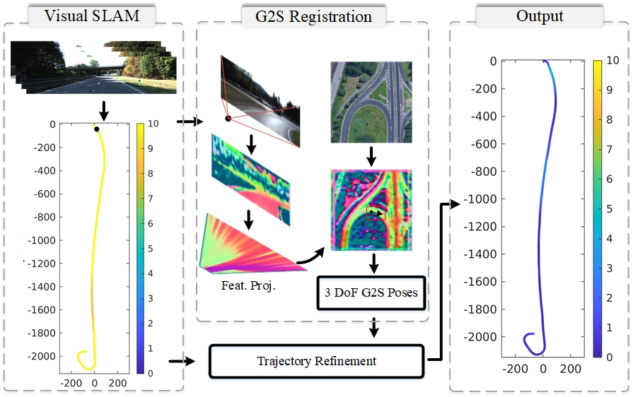

# increasing SLAM Pose Accuracy by Ground-to-Satellite Image Registration

Code of our work that is published on ICRA 2024. 

[//]: <> ## [Project website]( )

<p align="center">
  
</p>

We propose a framework that integrates a ground-to-satellite (G2S) cross-view registration method with visual SLAM for autonomous driving. Loop closure, which is crucial for reducing localization error, is not always available in autonomous driving. Conversely, G2S registration avoids error accumulation but lacks robustness. Our goal is to combine the advantages of both methods to achieve precise vision-based vehicle localization.

Our approach is straightforward: after obtaining the trajectory through visual SLAM, we implement a two-stage process to select valid G2S results: a coarse check using spatial correlation bounds, followed by a fine check using visual odometry consistency. The validated G2S results are then fused with the visual odometry from SLAM by solving a scaled pose graph. Experimental results demonstrate that our proposed method achieves high trajectory accuracy even without loop closure.


## Setups
### SLAM Trajectory
The raw SLAM trajectory is by [ORB-SLAM3](https://github.com/UZ-SLAMLab/ORB_SLAM3). We provide keyframes in `./data/kitti_2011_10_03_drive_0042_sync/` by one of the KITTI dataset as an example. You can add the following function to `./src/System.cc` in [ORB-SLAM3](https://github.com/UZ-SLAMLab/ORB_SLAM3), or write your own function to save the keyframes. 

```c++

void System::SaveKeyFrameTrajectoryKITTI(const string &filename, const string &filename2)
    {
        cout << endl << "Saving keyframe trajectory to " << filename << " ..." << endl;
        if(mSensor==MONOCULAR)
        {
            cerr << "ERROR: SaveKeyFrameTrajectoryKITTI cannot be used for monocular." << endl;
            return;
        }

        vector<KeyFrame*> vpKFs = mpAtlas->GetAllKeyFrames();
        sort(vpKFs.begin(),vpKFs.end(),KeyFrame::lId);

        // Transform all keyframes so that the first keyframe is at the origin.
        // After a loop closure the first keyframe might not be at the origin.
        Sophus::SE3f Tow = vpKFs[0]->GetPoseInverse();

        ofstream f;
        f.open(filename.c_str());
        f << fixed;

        ofstream f2;
        bool bsaveName = false;
        if(filename2.length()>0){
            bsaveName=true;
            f2.open(filename2.c_str());
            f2 << fixed;
        }


        for(size_t i=0; i<vpKFs.size(); i++)
        {
            KeyFrame* pKF = vpKFs[i];

            if(!pKF || pKF->isBad())
                continue;

            Sophus::SE3f Twc = pKF->GetPoseInverse();
            Eigen::Matrix3f Rwc = Twc.rotationMatrix();
            Eigen::Vector3f twc = Twc.translation();
            f << setprecision(9) << Rwc(0,0) << " " << Rwc(0,1)  << " " << Rwc(0,2) << " "  << twc(0) << " " <<
              Rwc(1,0) << " " << Rwc(1,1)  << " " << Rwc(1,2) << " "  << twc(1) << " " <<
              Rwc(2,0) << " " << Rwc(2,1)  << " " << Rwc(2,2) << " "  << twc(2) << endl;

            if(bsaveName)
                f2 << pKF->mNameFile <<endl;
        }
        f.close();
        f2.close();
    }
```


## G2S-SLAM-Fusion

### Usage

* The G2S part is in `./Boosting3DoFAccuracy/`
* Main function `main_kitti_G2SSLAMFusion.py`
* Results are saved in `save_path/test_kitti`


## Some Details

* The coarse-to-fine valid G2S selection is implemented in `main_kitti_G2SSLAMFusion.py`. For each valid G2S pose, a scaled pose graph is called via `main_crossview_sPGO_SLAM2oxts_CVandVOweights_Cov.m`. The solver is implemented in `./matlab/Optimizer17_poseGraph_SLAM2OXTS_VOCVWeights/`

* Show trajectory: `fig01_kitti_show_trajectory.m`


## Acknologement
The implementation is based on [Boosting3DoFAccuracy](https://github.com/YujiaoShi/Boosting3DoFAccuracy), where the code and the weights can be obtained. The visual SLAM trajectory is by [ORB-SLAM3](https://github.com/UZ-SLAMLab/ORB_SLAM3). Thanks for all of these great works.

## Todo
 - [ ] Upload the pre-trained weight as an example
 - [ ] Clean the code and remove some unused parts
 - [ ] Website for this work
 - [ ] Replacing the G2S Registration with the most SOTA work.
[//]: <> - [ ] Implement the G2S Resigration with the visual SLAM system. 


## Bitex
If you found this library useful for your research, please consider citing:

```
@article{zhang2024increasing,
  title={Increasing SLAM Pose Accuracy by Ground-to-Satellite Image Registration},
  author={Zhang, Yanhao and Shi, Yujiao and Wang, Shan and Vora, Ankit and Perincherry, Akhil and Chen, Yongbo and Li, Hongdong},
  journal={arXiv preprint arXiv:2404.09169},
  year={2024}
}

@inproceedings{shi2023boosting,
  title={Boosting 3-DoF Ground-to-Satellite Camera Localization Accuracy via Geometry-Guided Cross-View Transformer},
  author={Shi, Yujiao and Wu, Fei and Perincherry, Akhil and Vora, Ankit and Li, Hongdong},
  booktitle={Proceedings of the IEEE/CVF International Conference on Computer Vision},
  pages={21516--21526},
  year={2023}
}
```

Please do not hesitate to contact me at `yanhaozhang1991@gmail.com` or `yanhao.zhang@uts.edu.au`.
